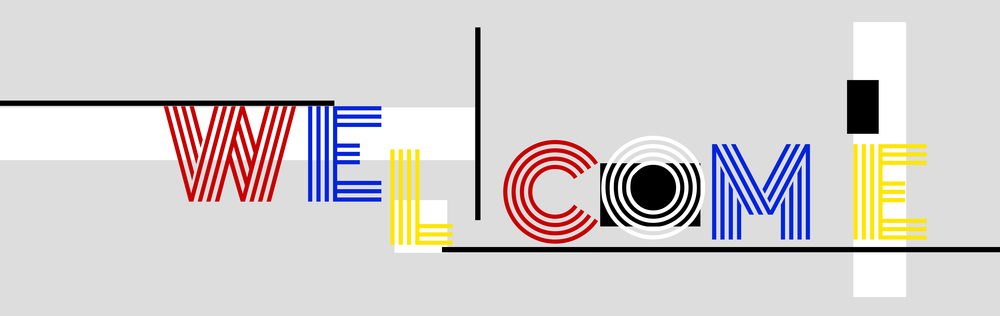

 
-------to my profile 👋-------

<!--
**PAINKILLER0504/PAINKILLER0504** is a ✨ _special_ ✨ repository because its `README.md` (this file) appears on your GitHub profile.

Here are some ideas to get you started:

- 🔭 I’m currently working on ...
- 🌱 I’m currently learning ...
- 👯 I’m looking to collaborate on ...
- 🤔 I’m looking for help with ...
- 💬 Ask me about ...
- 📫 How to reach me: ...
- 😄 Pronouns: ...
- ⚡ Fun fact: ...
-->

`前端开发` `平面设计` `PPT` `三维建模` `Digital media`

 ### 邮箱
> [dengrui0504@163.com](mailto:dengrui0504@163.com)
 ### 个人网页
<!--
> [helendeng.site](https://helendeng.site)
-->
> <a href="https://helendeng.site/" target="_blank">helendeng.site</a>

---
### 一些小项目
> vite+react+Framer Motion响应式动画网页
>> <a href="https://painkiller0504.github.io/HenryLau/" target="_blank">-刘宪华的个人介绍</a>

> vite+react+Appwrite留言板
>> <a href="https://painkiller0504.github.io//NotesBoard/" target="_blank">留言板</a>

> css-蒙德里安时钟
>> <a href="https://painkiller0504.github.io/Mondrian-style-clock/" target="_blank">Mondrian-stlye-clock</a>

> canvas-星空
>> <a href="https://painkiller0504.github.io/starrySky/" target="_blank">starrySky</a>

