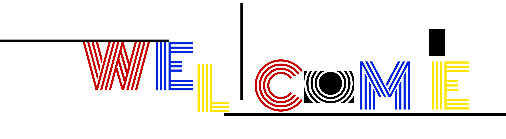

 
to my profile 👋

<!--
**PAINKILLER0504/PAINKILLER0504** is a ✨ _special_ ✨ repository because its `README.md` (this file) appears on your GitHub profile.

Here are some ideas to get you started:

- 🔭 I’m currently working on ...
- 🌱 I’m currently learning ...
- 👯 I’m looking to collaborate on ...
- 🤔 I’m looking for help with ...
- 💬 Ask me about ...
- 📫 How to reach me: ...
- 😄 Pronouns: ...
- ⚡ Fun fact: ...
-->

`前端开发` `平面设计` `PPT` `三维建模`

 ### 邮箱
> [dengrui0504@163.com](mailto:dengrui0504@163.com)
 ### 个人网页
> [helendeng.site](https://helendeng.site)
